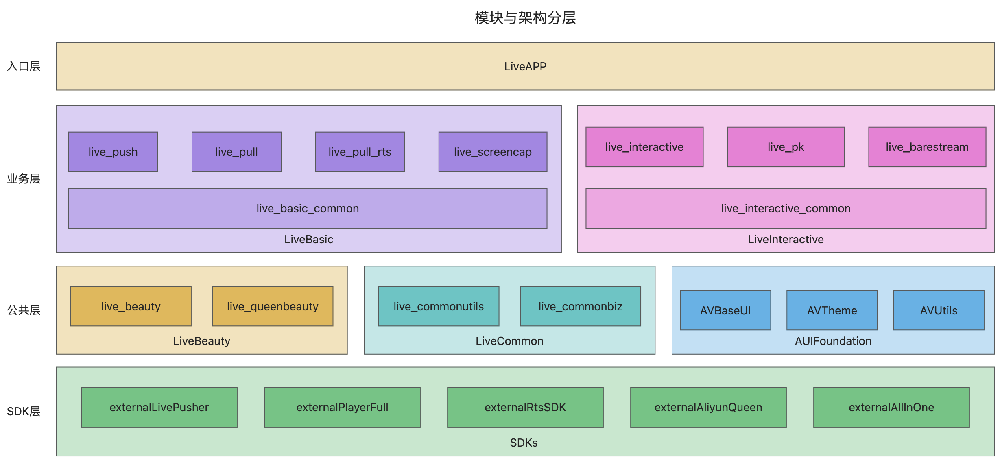

# amdemos-android-live

A demo project for Apsara Video Live Push SDK.

## **一、Demo体验**

> **官网文档**：[推流SDK · Demo体验](https://help.aliyun.com/zh/live/developer-reference/sdk-download-and-release-notes?#section-cra-t8n-o2q)


## **二、Demo编译**

> **官网文档**：[Android推流SDK · Demo编译](https://help.aliyun.com/zh/live/developer-reference/push-sdk-for-android-demo-compilation)

### **1、IDE**

* Android Studio

> [Download Android Studio & App Tools - Android Developers](https://developer.android.com/studio?hl=zh-cn)

### **2、环境要求**

* Gradle 7.5-bin，插件版本7.1.2

* **JDK 11**

> JDK 11设置方法：Preferences -> Build, Execution, Deployment -> Build Tools -> Gradle -> Gradle JDK -> 选择 11（如果没有11，请升级你的Android Studio版本）

### **3、项目说明**

#### **模块与架构分层**



#### **模块说明**

```html
.
├── AUIFoundation  # AUI基础组件目录，用于管理UI基础组件、UI主题风格等
│   ├── AVBaseUI
│   ├── AVMatisse
│   ├── AVTheme
│   ├── AVUtils
│   └── README.md
├── AndroidThirdParty # 三方依赖目录，用于管理项目依赖的三方SDK及版本
│   └── config.gradle
├── LiveApp # Demo Application入口
├── LiveBasic # 基础直播目录，包含所有基础直播的功能模块
│   ├── live_basic_common # 基础直播-公共模块
│   ├── live_pull # RTMP基础直播拉流功能
│   ├── live_pull_rts # RTS低延迟直播拉流功能
│   ├── live_push # 摄像头推流功能
│   └── live_screencap # 录屏推流功能
├── LiveBeauty # 直播美颜目录，包含基础直播/互动直播的美颜前处理解决方案
│   ├── README.md # 直播美颜说明文档
│   ├── live_beauty # 直播美颜-抽象接口模块
│   └── live_queenbeauty # 直播美颜-基于Queen SDK的封装实现模块
├── LiveCommon # 公共组件目录，包含Demo工具类、公共业务等
│   ├── live_commonbiz # 直播Demo公共业务模块
│   └── live_commonutils # 直播Demo工具类模块
├── LiveInteractive # 互动直播目录，包含所有互动直播的功能模块
│   ├── live_barestream # 互动直播-推拉裸流功能
│   ├── live_interactive # 互动直播-连麦功能
│   ├── live_interactive_common # 互动直播-公共模块
│   └── live_pk # 互动直播-PK功能
├── README.md # 项目说明文档
├── build.gradle
├── gradle
│   └── wrapper
```

## **三、SDK集成**

>  **官网文档**：[Android推流SDK · SDK集成](https://help.aliyun.com/zh/live/developer-reference/integrate-push-sdk-for-android)

### **Android推荐使用maven集成：**

#### **1、在工程build.gradle配置脚本中的dependencies中添加如下代码**

- **基础版**

```groovy
implementation "com.alivc.pusher:AlivcLivePusher:${version}"
```

- **互动版**

```groovy
implementation "com.alivc.pusher:AlivcLivePusher_Interactive:${version}"
```

* **版本更新记录**
  * [SDK下载与发布记录](https://help.aliyun.com/zh/live/developer-reference/sdk-download-and-release-notes)

  * [SDK download and release notes](https://www.alibabacloud.com/help/en/live/developer-reference/sdk-download-and-release-notes)


#### **2、在项目build.gradle中增加Maven源**

```groovy
maven { url 'https://maven.aliyun.com/nexus/content/repositories/releases' }
```

#### **3、在 defaultConfig 中，指定App使用的CPU架构（目前SDK支持armeabi-v7a 和 arm64-v8a，不支持模拟器调试）**

```groovy
defaultConfig {
  ndk {
    abiFilters "armeabi-v7a", "arm64-v8a"
  }
}
```

#### **4、配置License**

推流SDK升级到4.4.2及以后版本，接入一体化License服务，您需要配置License文件。具体操作，请参见[推流SDK License集成指南](https://help.aliyun.com/zh/live/developer-reference/integrate-a-push-sdk-license)。

#### **5、其它工程配置**

* **配置App权限**

> **官网文档**：[配置App权限](https://help.aliyun.com/zh/live/developer-reference/integrate-push-sdk-for-android#12c072b07azus)

* **配置混淆规则**

> **官网文档**：[配置混淆规则](https://help.aliyun.com/zh/live/developer-reference/integrate-push-sdk-for-android#5c0354b07anys)

#### **6、美颜接入指南**

请参考 **LiveBeauty** 模块下的 README.md 文档，通过 LiveBeauty 插件，一键集成直播美颜功能。

#### **7、集成与编译问题指南**

> **官网文档**：[Android推流SDK · 错误异常及特殊场景处理](https://help.aliyun.com/zh/live/developer-reference/handling-of-exceptions-and-special-scenarios-for-android)

* **SDK集成问题：集成多个SDK冲突**

如您同时集成 [直播推流SDK](https://help.aliyun.com/zh/live/developer-reference/push-sdk-for-android/) 和 [播放器SDK](https://help.aliyun.com/zh/vod/developer-reference/apsaravideo-player-sdk-for-android/)，或其它阿里云音视频SDK；在组合编译时，部分SDK版本，可能会存在字节码冲突问题（Duplicate class）。请使用 音视频终端SDK 避免冲突，集成方式请参考[标准集成·Android端](https://help.aliyun.com/zh/apsara-video-sdk/developer-reference/fast-integration-for-android)。

* **SDK集成方式**

如您希望以 本地aar 形式集成，我们在官网文档[SDK下载与发布记录](https://help.aliyun.com/zh/live/developer-reference/sdk-download-and-release-notes)中，为您提供了SDK下载包。

如您希望以 音视频终端SDK 形式集成，集成方式请参考[标准集成·Android端](https://help.aliyun.com/zh/apsara-video-sdk/developer-reference/fast-integration-for-android)。

* **Demo编译配置**
  
  * **基础版 与 互动版 切换**
    
    * `gradle.properties`文件中`SDK_TYPE`编译配置，决定输出的Demo功能模块
    * AliVCSDK_BasicLive->基础版，AliVCSDK_InteractiveLive->互动版
    * 基础版，仅包含基础直播相关功能；互动版（默认），包含基础直播与互动直播功能
    
  * **直播推流SDK 与 音视频终端SDK 切换**
    
    * `gradle.properties`文件中`allInOne`编译配置，决定使用的SDK类型
    * true，使用音视频终端SDK；false，使用直播推流SDK；对应关系如下：
    
    |                    |    SDK_TYPE=AliVCSDK_BasicLive    |      SDK_TYPE=AliVCSDK_InteractiveLive       |
    | ------------------ | :-------------------------------: | :------------------------------------------: |
    | **allInOne=false** | com.alivc.pusher:AlivcLivePusher  | com.alivc.pusher:AlivcLivePusher_Interactive |
    | **allInOne=true**  | com.aliyun.aio:AliVCSDK_BasicLive |   com.aliyun.aio:AliVCSDK_InteractiveLive    |
    
  
* **Demo编译问题：Gradle Distribution无法访问**

由于近期Gradle将gradle distributions的后端存储服务，切换到了GitHub上，而GitHub在国内的访问存在不稳定因素，可能会导致访问失败，因此出现Demo编译失败的问题。解决gradle distribution的问题，即可完成Demo项目的跑通。

## **四、链接指引**

### **文档**

* [阿里云·视频直播](https://www.aliyun.com/product/live)
* [推流SDK](https://help.aliyun.com/zh/live/developer-reference/push-sdk)
* [推流SDK · API接口文档](https://help.aliyun.com/zh/live/developer-reference/integrate-push-sdk-for-android#section-d8t-6hq-n0d)
* [直播连麦](https://help.aliyun.com/zh/live/user-guide/co-streaming-overview)
* [直播连麦快速入门](https://help.aliyun.com/zh/live/user-guide/quick-start-live-co-streaming)
* [音视频终端SDK](https://help.aliyun.com/zh/apsara-video-sdk/)

### **控制台**

* [直播控制台](https://live.console.aliyun.com/)
* [直播连麦控制台](https://live.console.aliyun.com/connect_microphone/demo#/connect_microphone/demo)
* [License控制台](https://live.console.aliyun.com/connect_microphone/demo#/sdks/license)

### **Global**

* [ApsaraVideo Live](https://www.alibabacloud.com/zh/product/apsaravideo-for-live)
* [Push SDK](https://www.alibabacloud.com/product/apsaravideo-for-live/streaming-sdk)
* [Push SDK Doc](https://www.alibabacloud.com/help/en/live/developer-reference/push-sdk/)
* [Push SDK API Doc](https://www.alibabacloud.com/help/en/live/developer-reference/integrate-push-sdk-for-android#f0c462b07a1rh)
* [Interactive streaming](https://www.alibabacloud.com/help/en/live/user-guide/interactive-streaming-overview)

### **其它**

* **历史下载包追溯**

在官网文档[SDK下载与发布记录](https://help.aliyun.com/zh/live/developer-reference/sdk-download-and-release-notes)中，我们提供了最新的下载包。如：SDK（如：[v6.8.0](https://alivc-demo-cms.alicdn.com/versionProduct/installPackage/livePush/Interactive/v6.8.0/cn/SDK/AlivcLivePusher_Interactive_6.8.0_Android.zip)）、Demo源码（如：[v6.8.0](https://alivc-demo-cms.alicdn.com/versionProduct/installPackage/livePush/Interactive/v6.8.0/cn/Demo/AlivcLivePusherDemo_Interactive_6.8.0_Android.zip)）、API文档（如：[v6.8.0](https://alivc-demo-cms.alicdn.com/versionProduct/doc/live_pusher_interactive/6.8.0/Android/cn/annotated.html)）等。如需追溯历史版本的下载包，您可以自行改动下载地址里面的版本号，进行下载。

* **SDK合规**
  * [SDK隐私权政策及合规使用说明](https://help.aliyun.com/zh/live/developer-reference/sdk-download-and-release-notes#76a8fc617eqqa)
  

## **五、帮助**

如果您在使用推流SDK有任何问题或建议，欢迎通过钉钉搜索群号32825314或44911608加入推流SDK开发者生态群。

[视频直播-帮助中心](https://help.aliyun.com/product/29949.html)

[ApsaraVideo Live Help](https://www.alibabacloud.com/help/en/apsaravideo-live)
