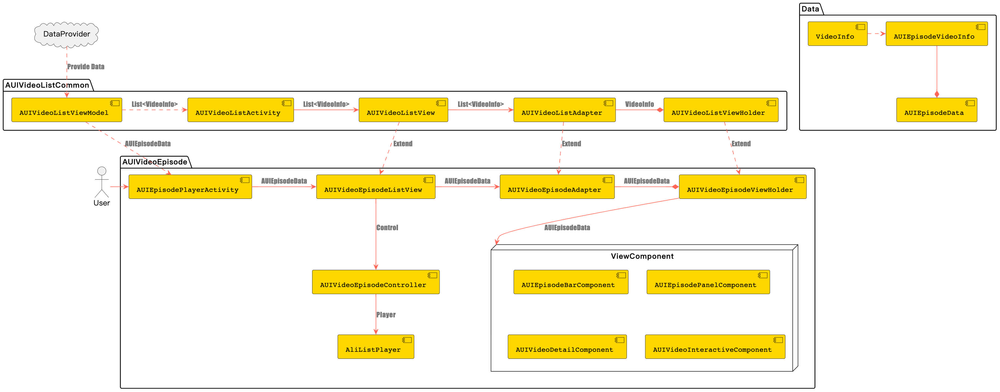
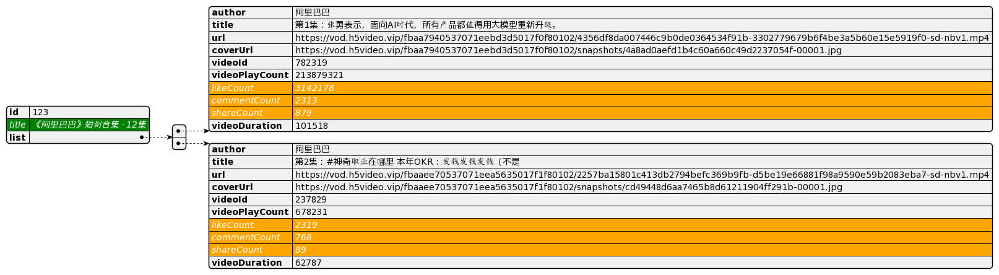

# **AUIVideoEpisode**

## **一、模块介绍**

**AUIVideoEpisode**模块，为微短剧场景模块。提供抽屉式剧集列表，负责播放展示指定短剧剧集，获得沉浸式播放体验。

## **二、前置条件**

您已获取音视频终端SDK的播放器的License授权和License Key。获取方法，请参见[申请License](https://help.aliyun.com/zh/apsara-video-sdk/user-guide/license-authorization-and-management#13133fa053843)。

## **三、编译运行**

参见AUIVideoList/README.md。
                                                           
注：请确认您的视频源地址，如果视频源地址为模块提供的 MP4 私有加密地址，由于加密特性，集成到您项目工程中将会播放失效。请注意修改 AUIEpisodeConstants 文件下的 EPISODE_JSON_URL 的变量值，手动切换剧集地址。

## **四、模块说明**

### **文件说明**

```html
.
└── videoepisode                                            # 短剧根目录
    ├── AUIEpisodePlayerActivity.java                      # 短剧页面
    ├── AUIVideoEpisodeController.java                      # 短剧页面控制器
    ├── adapter                                             # 适配器根目录
    │   ├── AUIEpisodePanelAdapter.java                     # 短剧面板适配器
    │   └── AUIVideoEpisodeAdapter.java                      # 短剧视频页面适配器
    ├── annotation                                          # 枚举类目录
    │   └── PreRenderPlayerState.java                        # 预渲染状态枚举
    ├── component                                           # 页面组件目录
    │   ├── AUIEpisodeBarComponent.java                     # 短剧页面底部bar组件
    │   ├── AUIEpisodePanelComponent.java                    # 短剧选集列表组件
    │   ├── AUIVideoDetailComponent.java                     # Feed流页面详情组件（用户名、视频详情）
    │   └── AUIVideoInteractiveComponent.java                # Feed流页面交互组件（点赞、评论、分享）
    ├── data                                                # 数据结构目录
    │   ├── AUIEpisodeConstants.java                        # 短剧常量类
    │   ├── AUIEpisodeData.java                              # 短剧剧集数据结构
    │   ├── AUIEpisodeDataEvent.java                         # 短剧剧集更新事件
    │   └── AUIEpisodeVideoInfo.java                         # 短剧单集视频数据
    ├── listener                                            # 回调与监听目录
    │   ├── OnDetailEventListener.java                      # Feed流页面详情组件回调事件
    │   ├── OnInteractiveEventListener.java                 # Feed流页面交互组件回调事件
    │   ├── OnPanelEventListener.java                       # 短剧选集列表组件回调事件
    │   └── OnSurfaceListener.java                          # 短剧视频页面Surface状态回调事件
    └── view                                                # 视图目录
        ├── AUIVideoEpisodeLayoutManager.java               # 短剧Feed流上下滑页面骨架控制器
        └── AUIVideoEpisodeListView.java                     # 短剧Feed流上下滑页面骨架
```

### **架构设计**



### **入口页面**

* **AUIEpisodePlayerActivity**

**外部对接**：如果需要将短剧页面作为一个原子页面供外部进行跳转使用，只需要将AUIEpisodePlayerActivity中数据来源DataProvider去除；取而代之的是，在页面跳转时，同步传递AUIEpisodeData数据到当前页面即可。

### **数据定义**

* **短剧剧集**

AUIEpisodeData

| 字段  | 含义             |
| ----- | ---------------- |
| id    | 短剧剧集唯一ID   |
| title | 短剧剧集名称     |
| list  | 短剧剧集视频列表 |

* **单集视频**

AUIEpisodeVideoInfo



继承自基类VideoInfo，新增了橙色部分的字段，主要为：点赞数、评论数，和分享数。

### **数据来源**

当前Demo中的数据为mock数据，取自网页json，参考常量`EPISODE_JSON_URL`。

取数据逻辑：AUIVideoListViewModel.DataProvider<AUIEpisodeData> dataProvider，通过onLoadData请求短剧数据。

## **五、核心能力介绍**

### **本地缓存**

```java
// 开启本地缓存
public void enableLocalCache(boolean enable, String path) {
    AliPlayerGlobalSettings.enableLocalCache(enable, 10 * 1024, path);
    PlayerConfig config = aliListPlayer.getConfig();
    config.mEnableLocalCache = enable;
    aliListPlayer.setConfig(config);
}

// 设置缓存清除策略
public void setCacheFileClearConfig(long expireMin, long maxCapacityMB, long freeStorageMB) {
  AliPlayerGlobalSettings.setCacheFileClearConfig(expireMin, maxCapacityMB, freeStorageMB);
}

// 清除缓存
public void clearCache() {
  AliPlayerGlobalSettings.clearCaches();
}
```

### **智能预加载**

```java
// 设置预加载数量
public void setPreloadCount(int preloadCount) {
  aliListPlayer.setPreloadCount(preloadCount);
}

// 设置智能预加载策略
public void setPreloadStrategy(boolean enable, String params) {
  aliListPlayer.setPreloadScene(IListPlayer.SceneType.SCENE_SHORT);
  aliListPlayer.enablePreloadStrategy(IListPlayer.StrategyType.STRATEGY_DYNAMIC_PRELOAD_DURATION, enable);
  if (enable) {
    aliListPlayer.setPreloadStrategy(IListPlayer.StrategyType.STRATEGY_DYNAMIC_PRELOAD_DURATION, params);
  }
}
```

### **智能预渲染**

```java
// 设置智能预渲染
// 备注：当前版本，PreRender Player仅支持预渲染列表下一个视频的画面；指定预渲染上一个视频的画面，有待后续版本支持。
public void setSurfaceToPreRenderPlayer(Surface surface) {
  preRenderPlayer = aliListPlayer.getPreRenderPlayer();
  if (preRenderPlayer != null) {
    preRenderPlayer.setOnRenderingStartListener(() -> {
      mCurrentPreRenderPlayerState = PreRenderPlayerState.FIRST_FRAME_RENDERED;
    });
    preRenderPlayer.setSurface(surface);
    if (mNeedPreRender && surface != null) {

      //RenderingStart前一直尝试刷新
      preRenderPlayer.seekTo(0);
      if (mCurrentPreRenderPlayerState == PreRenderPlayerState.FIRST_FRAME_RENDERED) {
        mNeedPreRender = false;
      }
    }
  } else {
    aliListPlayer.clearScreen();
    aliListPlayer.setSurface(surface);
  }
}
```

### **HTTPDNS**

```java
/**
 * 开启HTTPDNS
 */
public void enableHTTPDNS(boolean enable) {
    AliPlayerGlobalSettings.enableHttpDns(enable);
    PlayerConfig config = aliListPlayer.getConfig();
    config.mEnableHttpDns = -1;
    aliListPlayer.setConfig(config);
}

/**
 * 开启增强型HTTPDNS
 * <p>
 * 与enableHTTPDNS互斥
 * 如果开启增强型HTTPDNS，需要增强型HTTPDNS的高级License，否则将会失效
 * 如果该功能开启失效，会打印错误日志“enhanced dns license is invalid, open enhanced dns failed”
 * 播放器SDK版本要求：> 6.10.0
 */
public void enableEnhancedHTTPDNS(Context context, boolean enable) {
    PrivateService.preInitService(context);
    //打开增强型HTTPDNS
    AliPlayerGlobalSettings.enableEnhancedHttpDns(enable);
    //必选，添加增强型HTTPDNS域名，请确保该域名为阿里云CDN域名并完成域名配置可以正常可提供线上服务。
    DomainProcessor.getInstance().addEnhancedHttpDnsDomain("player.***alicdn.com");
    //可选，增加HTTPDNS预解析域名
    DomainProcessor.getInstance().addPreResolveDomain("player.***alicdn.com");
    // AliPlayerGlobalSettings.SET_DNS_PRIORITY_LOCAL_FIRST表示设置HTTPDNS的优先级
    AliPlayerGlobalSettings.setOption(AliPlayerGlobalSettings.SET_DNS_PRIORITY_LOCAL_FIRST, enable ? 1 : 0);
}
```

### **MP4私有加密**

从v6.8.0版本开始（一体化SDK or 播放器SDK），播放器支持MP4加密播放能力。

* 加密视频可播放，需满足以下条件：

  * 1.私有加密的mp4，业务侧（app侧）需要给 URL 追加`etavirp_nuyila=1`

  * 2.app的license对应的uid 与 产生私有加密mp4的uid 是一致的

* 校验加密视频是否正确，以私有加密的视频URL为例：

  * meta信息里面带有`AliyunPrivateKeyUri`的tag
  * ffplay不能直接播放

### **其它功能**

* **防录屏**

  ```java
  // Android特有功能，禁止app录屏和截屏
  getWindow().setFlags(WindowManager.LayoutParams.FLAG_SECURE, WindowManager.LayoutParams.FLAG_SECURE);
  ```


## 六、用户指引

### **文档**

[播放器SDK](https://help.aliyun.com/zh/vod/developer-reference/apsaravideo-player-sdk/)

[音视频终端SDK](https://help.aliyun.com/product/261167.html)

[阿里云·视频点播](https://www.aliyun.com/product/vod)

[视频点播控制台](https://vod.console.aliyun.com)

[ApsaraVideo VOD](https://www.alibabacloud.com/zh/product/apsaravideo-for-vod)


### **FAQ**

如果您在使用播放器SDK有任何问题或建议，欢迎通过钉钉搜索群号31882553加入阿里云播放器SDK开发者群。

