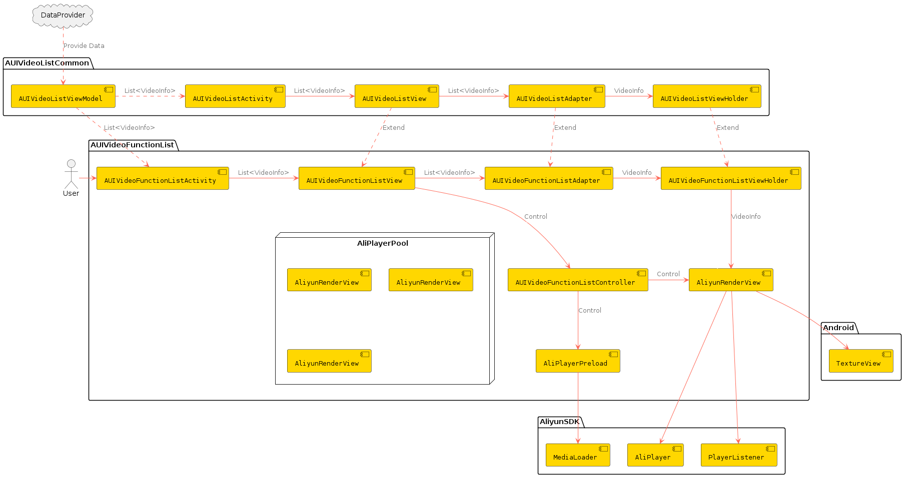

# **AUIVideoFunctionList**

## **一、模块介绍**

**AUIVideoFunctionList**模块使用多个播放器实例（AliPlayer）+ 预加载（MediaLoader）+ 预渲染的方式实现短视频列表播放，结合本地缓存可以达到更好体验。

## **二、前置条件**

您已获取音视频终端SDK的播放器的License授权和License Key。获取方法，请参见[申请License](https://help.aliyun.com/zh/apsara-video-sdk/user-guide/license-authorization-and-management#13133fa053843)。

## **三、编译运行**

参见AUIVideoList/README.md。

## **四、模块说明**
### **文件说明**

```html
.
└── videoefunctionlist                                     # 根目录
    ├── AUIFunctionListPlayerActivity.java                 # 多实例页面
    ├── AUIVideoFunctionListController.java                # 多实例页面控制器
    ├── AUIVideoFunctionListView.java                      # 视频列表视图
    ├── adapter                                           
    │   ├── AUIVideoFunctionListAdapter.java               # 多实例面板适配器
    │   └── AUIVideoFunctionListLayoutManager.java         # 布局管理器
    └── player                                          
        ├── AliPlayerPool.java                                      # 播放器池
        ├── AliPlayerPreload.java                          # 预加载
        └── AliyunRenderView.java                          # 视频渲染与播放
```

### **架构设计**



### **入口页面**

* **AUIVideoFunctionListActivity**

**外部对接**：如果需要将多实例页面作为一个原子页面供外部进行跳转使用，同样是将DataProvider去除，页面跳转时同步传递List\<VideoInfo\>数据到当前页面即可。

### **数据来源**

当前Demo中的数据取自本地videolist.json。

取数据逻辑：AUIVideoListViewModel.DataProvider<List\<VideoInfo\>> dataProvider，通过onLoadData请求数据。

如果通过API请求获取数据，可以重写加载数据函数，直接传入List\<VideoInfo\>数据。

## **五、核心能力介绍**

### **预加载**

```java
// 使用阿里云播放器SDK的 MediaLoader 组件进行加载
private void load(String url) {
    if(!mIsLive){
        mMediaLoader.load(url, GlobalSettings.DURATION);
    }
}
// 取消加载
private void cancel(String url) {
    if(!mIsLive){
        mMediaLoader.cancel(url);
    }
}
//加载下一个媒体资源
private void loadNext() {
    if (hasNext(mOldPosition.get())) {
        int next = mOldPosition.incrementAndGet();
        load(mUrlLinkedList.get(next).getUrl());
    }
}
//移动到指定位置并加载该位置之后的视频
public void moveToSerial(int position) {
    mExecutorService.execute(() -> {
        //cancel first
        int i = mOldPosition.get();
        if (i >= 0 && i < mUrlLinkedList.size()) {
            cancel(mUrlLinkedList.get(mOldPosition.get()).getUrl());
        }
        //load
        if (hasNext(position)) {
            load(mUrlLinkedList.get(position + 1).getUrl());
        }
       mOldPosition.set(position + 1);
    });
}

```

### **页面事件响应**

```java
// 选中某一视频
public void onPageSelected(int position, AUIVideoListViewHolder viewHolder) {
    this.mCurrentPosition = position;
    mIsPreloading = false;
    mAliPlayerPreload.cancel(position);
    if (viewHolder instanceof AUIVideoFunctionListAdapter.AUIVideoFunctionListViewHolder) {
        AliyunRenderView aliPlayer = ((AUIVideoFunctionListAdapter.AUIVideoFunctionListViewHolder) viewHolder).getAliPlayer();
        aliPlayer.getAliPlayer().start();
    }
}
// 页面滑动到一半
public void onPageHideHalf(int position, AUIVideoListViewHolder viewHolder) {
    if (viewHolder instanceof AUIVideoFunctionListAdapter.AUIVideoFunctionListViewHolder) {
        ((AUIVideoFunctionListAdapter.AUIVideoFunctionListViewHolder) viewHolder).getAliPlayer().pause();
        viewHolder.showPlayIcon(false);
    }
}
// 页面释放
public void onPageRelease(int position, AUIVideoListViewHolder viewHolder) {
    if (viewHolder instanceof AUIVideoFunctionListAdapter.AUIVideoFunctionListViewHolder) {
        ((AUIVideoFunctionListAdapter.AUIVideoFunctionListViewHolder) viewHolder).getAliPlayer().pause();
    }
}

```

### **多实例播放器池**

```java
//初始化AliyunRenderView实例队列
public static void init(Context context) {
    if (mDequeue.size() != TOTAL_SIZE) {
        mDequeue.clear();
        mDequeue.add(new AliyunRenderView(context));
        mDequeue.add(new AliyunRenderView(context));
        mDequeue.add(new AliyunRenderView(context));
    }
}
//获取一个AliyunRenderView实例
public static AliyunRenderView getPlayer() {
    AliyunRenderView aliyunRenderView = mDequeue.pollFirst();
    mDequeue.addLast(aliyunRenderView);
    return aliyunRenderView;
}
// 循环播放
public static void openLoopPlay(boolean openLoopPlay) {
    for (AliyunRenderView aliyunRenderView : mDequeue) {
        aliyunRenderView.openLoopPlay(openLoopPlay);
    }
}

```

### **预渲染**

```java
private void invokeSeekTo() {
    if (mHasCreateSurface && mHasPrepared) {
        mAliPlayer.seekTo(0);
        mHasCreateSurface = false;
        mHasPrepared = false;
    }
}

```
### **MP4私有加密**

从v6.8.0版本开始（一体化SDK or 播放器SDK），播放器支持MP4加密播放能力。

* 加密视频可播放，需满足以下条件：

  * 1.私有加密的mp4，业务侧（app侧）需要给 URL 追加`etavirp_nuyila=1`

  * 2.app的license对应的uid 与 产生私有加密mp4的uid 是一致的

* 校验加密视频是否正确，以私有加密的视频URL为例：

  * meta信息里面带有`AliyunPrivateKeyUri`的tag
  * ffplay不能直接播放

### **其它功能**

* **防录屏**

  ```java
  // Android特有功能，禁止app录屏和截屏
  getWindow().setFlags(WindowManager.LayoutParams.FLAG_SECURE, WindowManager.LayoutParams.FLAG_SECURE);
  ```

## 六、用户指引

### **文档**

[播放器SDK](https://help.aliyun.com/zh/vod/developer-reference/apsaravideo-player-sdk/)

[音视频终端SDK](https://help.aliyun.com/product/261167.html)

[阿里云·视频点播](https://www.aliyun.com/product/vod)

[视频点播控制台](https://vod.console.aliyun.com)

[ApsaraVideo VOD](https://www.alibabacloud.com/zh/product/apsaravideo-for-vod)


### **FAQ**

如果您在使用播放器SDK有任何问题或建议，欢迎通过钉钉搜索群号31882553加入阿里云播放器SDK开发者群。

